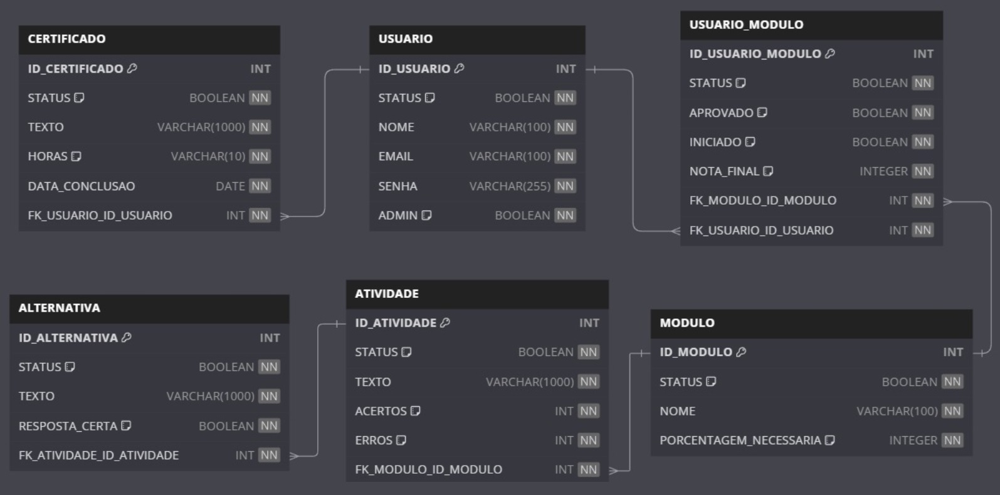

# Back end - aplicativo Motocilcista Consciente

Este projeto é o back end de um aplicativo chamado motociclista consciente, que visa ensinar e conscientizar atráves de um jogo de perguntas e respostas que é desenvolvido em Node.js e Express. Ele fornece uma API RESTful para gerenciar entidades como **certificado**, **usuarios**, **usuario_modulo**,**modulos**, **atividade** e **alternativa**.

---

## Tecnologias Utilizadas

- Node.js
- Express
- Swagger (para documentação de API)
- JavaScript

---

## Modelagem do banco de dados


## Instalação

### Pré-requisitos
- Node.js (v20.x ou superior)
- NPM (Node Package Manager)

### Passos para Instalação
1. Clone este repositório:
   ```bash
   git clone https://github.com/seu-usuario/nome-do-repositorio.git
2. Entre no diretório do projeto:
   ```bash
   cd nome-do-repositorio
3. Instale as dependências:
   ```bash
   npm install
4. Crie o banco de Dados em seu SGBD de preferencia, sendo necessario que o banco seja relacional:
   ```bash
   CREATE DATABASE cmtu;

   USE cmtu;

   CREATE TABLE CERTIFICADO (
      ID_CERTIFICADO INT AUTO_INCREMENT PRIMARY KEY,
      STATUS BOOLEAN DEFAULT TRUE,
      TEXTO VARCHAR(1000) NOT NULL,
      HORAS VARCHAR(10) DEFAULT '0',
      DATA_CONCLUSAO DATE NOT NULL,
      FK_USUARIO_ID_USUARIO INT NOT NULL
   );

   CREATE TABLE USUARIO (
      ID_USUARIO INT AUTO_INCREMENT PRIMARY KEY,
      STATUS BOOLEAN DEFAULT TRUE,
      NOME VARCHAR(100) NOT NULL,
      EMAIL VARCHAR(100) UNIQUE NOT NULL,
      SENHA VARCHAR(255) NOT NULL,
      ADMIN BOOLEAN DEFAULT FALSE,
      CONSTRAINT CHK_STATUS CHECK (STATUS IN (0, 1))
   );

   CREATE TABLE USUARIO_MODULO (
      ID_USUARIO_MODULO INT AUTO_INCREMENT PRIMARY KEY,
      STATUS BOOLEAN DEFAULT TRUE,
      APROVADO BOOLEAN DEFAULT FALSE,
      INICIADO BOOLEAN DEFAULT FALSE,
      NOTA_FINAL INTEGER DEFAULT 0 CHECK (NOTA_FINAL >= 0 AND NOTA_FINAL <= 100),
      FK_MODULO_ID_MODULO INT NOT NULL,
      FK_USUARIO_ID_USUARIO INT NOT NULL
   );

   CREATE TABLE MODULO (
      ID_MODULO INT AUTO_INCREMENT PRIMARY KEY,
      STATUS BOOLEAN DEFAULT TRUE,
      NOME VARCHAR(100) NOT NULL,
      PORCENTAGEM_NECESSARIA VARCHAR(10) DEFAULT '60',
      CONSTRAINT CHK_PORCENTAGEM CHECK (CAST(PORCENTAGEM_NECESSARIA AS DECIMAL) BETWEEN 0 AND 100)
   );

   CREATE TABLE ATIVIDADE (
      ID_ATIVIDADE INT AUTO_INCREMENT PRIMARY KEY,
      STATUS BOOLEAN DEFAULT TRUE,
      TEXTO VARCHAR(1000) NOT NULL,
      ACERTOS INT DEFAULT 0,
      ERROS INT DEFAULT 0,
      FK_MODULO_ID_MODULO INT NOT NULL
   );

   CREATE TABLE ALTERNATIVA (
      ID_ALTERNATIVA INT AUTO_INCREMENT PRIMARY KEY,
      STATUS BOOLEAN DEFAULT TRUE,
      TEXTO VARCHAR(1000) NOT NULL,
      RESPOSTA_CERTA BOOLEAN DEFAULT FALSE,
      FK_ATIVIDADE_ID_ATIVIDADE INT NOT NULL
   );

   ALTER TABLE CERTIFICADO ADD CONSTRAINT FK_CERTIFICADO_2
      FOREIGN KEY (FK_USUARIO_ID_USUARIO)
      REFERENCES USUARIO(ID_USUARIO) ON DELETE CASCADE;

   ALTER TABLE USUARIO_MODULO ADD CONSTRAINT FK_USUARIO_MODULO_2
      FOREIGN KEY (FK_MODULO_ID_MODULO)
      REFERENCES MODULO(ID_MODULO) ON DELETE CASCADE;

   ALTER TABLE USUARIO_MODULO ADD CONSTRAINT FK_USUARIO_MODULO_3
      FOREIGN KEY (FK_USUARIO_ID_USUARIO)
      REFERENCES USUARIO(ID_USUARIO) ON DELETE RESTRICT;

   ALTER TABLE ATIVIDADE ADD CONSTRAINT FK_ATIVIDADE_2
      FOREIGN KEY (FK_MODULO_ID_MODULO)
      REFERENCES MODULO(ID_MODULO) ON DELETE CASCADE
      ON UPDATE CASCADE;

   ALTER TABLE ALTERNATIVA ADD CONSTRAINT FK_ALTERNATIVA_2
      FOREIGN KEY (FK_ATIVIDADE_ID_ATIVIDADE)
      REFERENCES ATIVIDADE(ID_ATIVIDADE) ON DELETE CASCADE;
5. configure a conexão com seu banco de dados no arquivo ds.js que esta localizado na pasta:
   ```bash
   database/db.js
6. Inicie o servidor:
   ```bash
   node server.js
```
```bash
Endpoints Principais
Método	Rota	Descrição
POST	/usuario/cadastro	Cadastrar um novo usuário
POST	/usuario/login	Realizar login
GET	/usuario/selecionarUsuarios	Listar todos os usuários
PUT	/usuario/editarSenha	Alterar a senha do usuário
GET	/api-docs	Acessar a documentação Swagger
Consulte a documentação completa no Swagger: http://localhost:8079/api-docs.

Estrutura do Projeto
📂 nome-do-projeto
├── 📂 controllers     # Lógica dos endpoints
├── 📂 routes          # Definição das rotas
├── 📂 database        # Configuração do banco de dados
├── 📂 middlewares     # Middleware de autenticação e validação
├── server.js          # Configuração do servidor
├── swagger.js         # Configuração do Swagger
└── package.json       # Gerenciamento de dependências
