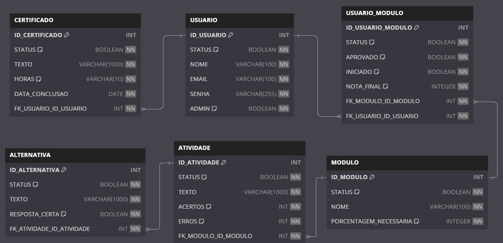

# Back end - aplicativo Motocilcista Consciente

Este projeto é o back end de um aplicativo chamado motociclista consciente, que visa ensinar e conscientizar atráves de um jogo de perguntas e respostas que é desenvolvido em Node.js e Express. Ele fornece uma API RESTful para gerenciar entidades como **usuários**, **módulos**, **certificados** e **atividades**.

---

## Tecnologias Utilizadas

- Node.js
- Express
- Swagger (para documentação de API)
- JavaScript

---

## Instalação

### Pré-requisitos
- Node.js (v20.x ou superior)
- NPM (Node Package Manager)

### Passos para Instalação
1. Clone este repositório:
   ```bash
   git clone https://github.com/seu-usuario/nome-do-repositorio.git
   
2. Entre no diretório do projeto:
   ```bash
   cd nome-do-repositorio
    
3.Instale as dependências:
   ```bash
  npm install
```
4.Inicie o servidor:
   ```bash
   node server.js
```
Endpoints Principais
Método	Rota	Descrição
POST	/usuario/cadastro	Cadastrar um novo usuário
POST	/usuario/login	Realizar login
GET	/usuario/selecionarUsuarios	Listar todos os usuários
PUT	/usuario/editarSenha	Alterar a senha do usuário
GET	/api-docs	Acessar a documentação Swagger
Consulte a documentação completa no Swagger: http://localhost:8079/api-docs.

Estrutura do Projeto
📂 nome-do-projeto
├── 📂 controllers     # Lógica dos endpoints
├── 📂 routes          # Definição das rotas
├── 📂 database        # Configuração do banco de dados
├── 📂 middlewares     # Middleware de autenticação e validação
├── server.js          # Configuração do servidor
├── swagger.js         # Configuração do Swagger
└── package.json       # Gerenciamento de dependências

## Modelagem do Banco de Dados



